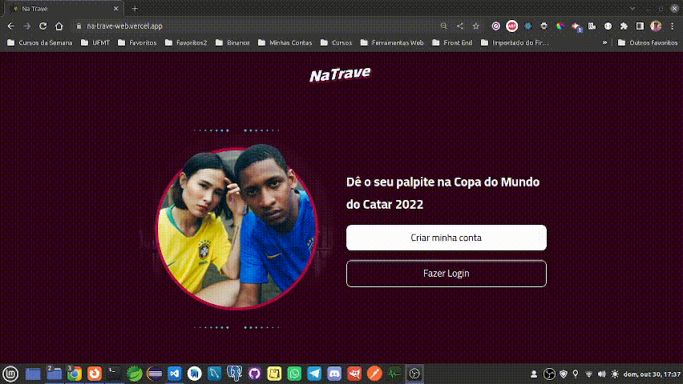
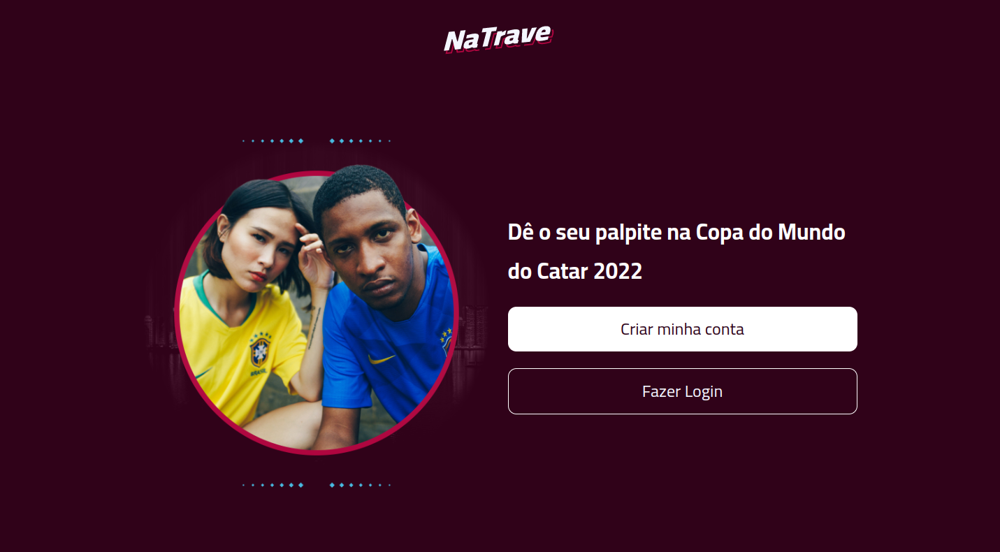
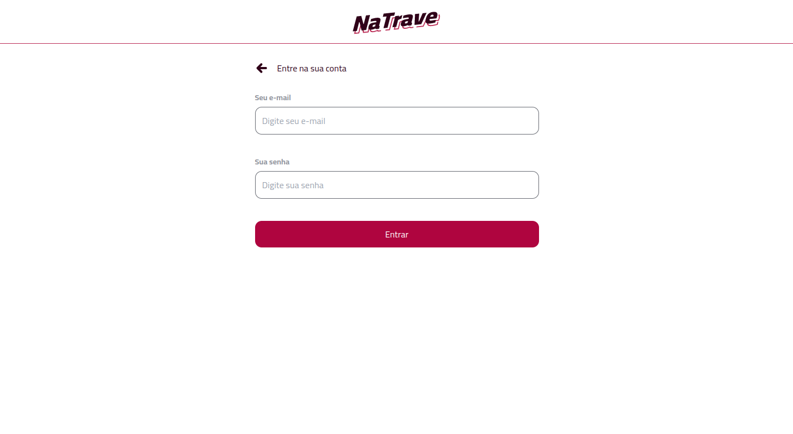
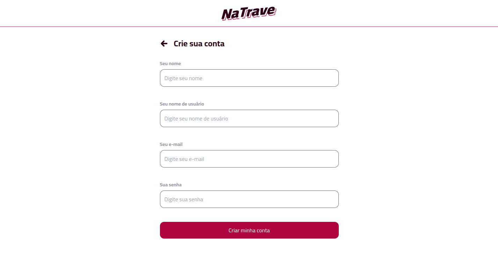
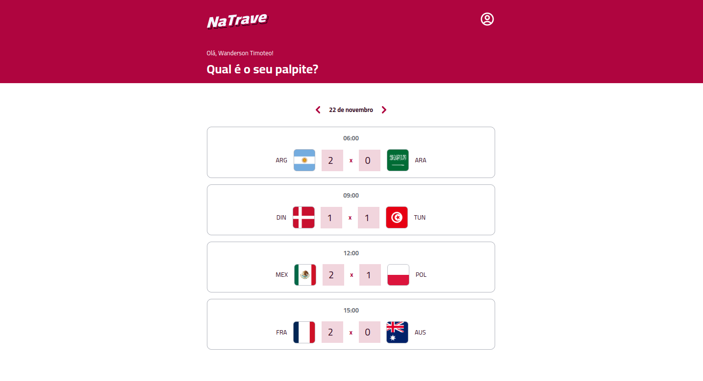
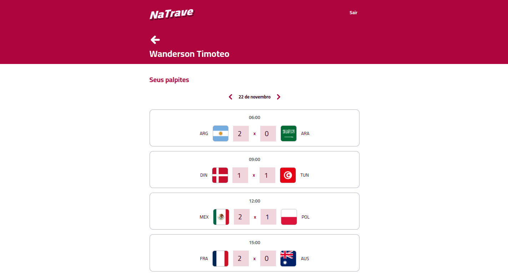

<p align="center">
    
</p>

<div align="center">
  <a href="#-projeto">Projeto</a>&nbsp;&nbsp;&nbsp;|&nbsp;&nbsp;&nbsp;
  <a href="#-tecnologias">Tecnologias</a>&nbsp;&nbsp;&nbsp;|&nbsp;&nbsp;&nbsp;
  <a href="#-layout">Layout</a>&nbsp;&nbsp;&nbsp;|&nbsp;&nbsp;&nbsp;
  <a href="#-layout">Licença</a>&nbsp;&nbsp;&nbsp;|&nbsp;&nbsp;&nbsp;
  <a href="#-layout">Autor</a>
</div>

<br> 

<p align="center">
  
  
  
</p>

<br>

## 💻 Projeto

O projeto consiste em um sistema para darmos palpites sobre cada jogo da Copa do Mundo Catar 2022. Nele podemos compartilhar nosso perfil público para que outros possam ver nossos palpites.

<br>

Este projeto foi desenvolvido com JWT e Bcrypt para autenticação e segurança criptografada para proteção dos dados. CI e CD com Vercel e PlanetScale.

<br>  

🔗 [Acessar site do projeto](https://na-trave-web.vercel.app/)

<br>


### Funcionalidades do sistema

<p align="center">
    
</p>
<br>

### Desktop - Tela Inicial

<p align="center">
    
</p>

<br>

### Desktop - Tela de Login 

<p align="center">
    
</p>
<p>
Tela de login com validação de campos. 
</p>
<br>

### Desktop - Tela de Cadastro

<p align="center">
    
</p>
<p>
Tela de cadastro com validação se já existe usuário cadastrado com mesmo e-mail e username. 
</p>

<br>

### Desktop - Tela de Dashboard

<p align="center">
    
</p>
<p> Neste tela podemos navegar pelas datas dos  jogos e verificar o horário (horário de Cuiabá-MT) de inicio e adicionar nosso palpite em cada jogo. 
</p>

<br>

### Desktop - Tela de Perfil

<p align="center">
    
</p>
<p> Neste tela podemos navegar pelas datas dos jogos e analisar os palpite em cada jogo, se desejar mudar de palpite em um determinado jogo, somente será possível pela tela de dashboard.
<br><br>
Nesta tela não conseguimos alterar os palpites, pois este perfil fica público para outros usuários verem seus palpites.
</p>
<br>
<br>

## 🚀 Tecnologias

Esse projeto foi desenvolvido com as seguintes tecnologias e ferramentas:

- [ReactJS](https://pt-br.reactjs.org/)
- [Vite](https://vitejs.dev/)
- [Tailwindcss](https://tailwindcss.com/)
- [NodeJS](https://nodejs.org/en/)
- [Koajs](https://koajs.com/)
- [Cors](https://www.npmjs.com/package/cors)
- [Axios](https://axios-http.com/ptbr/docs/intro)
- [Bcrypt](https://www.npmjs.com/package/bcrypt)
- [Date-FNS](https://date-fns.org/)
- [JWT](https://jwt.io/)
- [Formik](https://formik.org/)
- [Yup](https://www.npmjs.com/package/yup)
- [MySQL](https://www.mysql.com/)
- [Prisma ORM](https://www.prisma.io/)
- [PlanetScale](https://planetscale.com/)
- [Postman](https://www.postman.com/)
- [VSCode](https://code.visualstudio.com/https://aws.amazon.com/pt/s3)
- [Vercel](https://vercel.com/)


<br>

## 🔥 Executar Aplicação

### 🎇 Executando Localmente a Aplicação

Caso você deseja executar o projeto na sua máquina local, você precisará instalar o Node.js em sua máquima, após a instalação, basta seguir os passos abaixo:

### 🌀 Começando...

Para começar, você deve simplesmente clonar o repositório do projeto na sua máquina e instalar as dependências.

### ❗️ Instalando as Dependências (via Windows):

Abre o cmd (caso esteja utilizando o Windows) navegue até o local onde você clonou o projeto, exemplo:

```sh
C:\Users\NomeDoComputador\Documents\clonedoprojeto
```

Quando estiver na pasta do projeto, `na-trave`, dentro dela conterá outras três pastas sendo: **( server, web e github )**.
<br> 

Agora basta acessar as pastas server e web, abrir um terminal dentro dela e digite a seguinte instrução: **( dentro de cada pasta `na-trave` do projeto clonado )**

```sh
npm install
```

Ao digitar a instrução acima, automaticamente ele irá baixar todas as dependências listadas e definidas no arquivo package.json:

- `node_modules` - que contêm os packages do npm que precisará para o projeto.

Bom, ainda com o terminal **(ainda dentro da pasta server)** execute a instrução a seguir:

```sh
npm run start
```

Bom, ainda com o terminal **(ainda dentro da pasta web )** execute a instrução a seguir:

```sh
npm run dev
```

Pronto! dessa forma o projeto `na-trave`  estará rodando localmente em sua maquina, acesse:

```sh
http://localhost:5173
```

## 🚩 Tenho Dúvidas... O que fazer?

Caso tenha dúvidas sobre o código do projeto, sintam-se a vontade em abrir uma **[ISSUE AQUI](https://github.com/Wanderson-A-Timoteo/na-trave/issues)**. Assim que possível, responderei todas as dúvidas!

<br>

## 💡 Licença

Esse projeto está sob a licença MIT. Veja o arquivo [LICENSE](github/LICENSE.md) para mais detalhes.

<br>

## 🎆 Autor:

Feito com ♥ by

-  [**Wanderson A. Timóteo**](www.wandersontimoteo.ga)

<br>

## 🤝 Agradecimento


<p align="center">
  
</p>

- Projeto desenvolvido durante a Semana FullStack Challenge, da plataforma de ensino [Codar.me](https://codar.me/input).

- Agradecimento ao [Bruno Bertolini](https://www.instagram.com/codar.me/) por compartilhar conteúdo relevante e com qualidade de ensino.